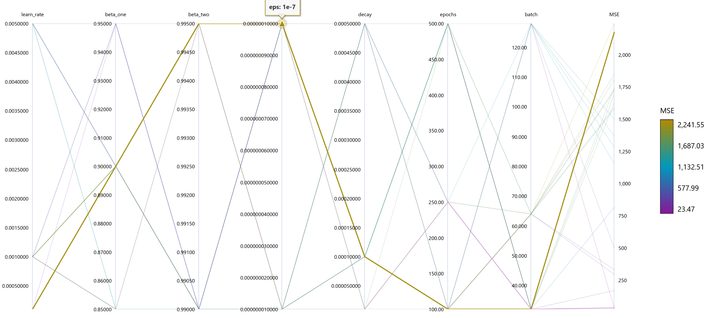

# Epigenetic clocks model on the basis of a small MLP
---
This repository contains a simplified machine learning model designed for educational purposes. The goal of the project is to develop a basic system that predicts human biological age from DNA methylation data — one of the best-studied molecular indicators of aging.

## Table of contents
---
- [Introduction](##introduction)
- [Limitations](##limitations)
- [Dataset](##dataset)
- [Model](##model)
    - [Hyperparameters tunning](###hyperparameters-tunning)
- [Metrics](##metrics)
- [Folder structure](##folder-structure)

## Introduction
---
The concept behind the project is based on the current efforts to develop theoretical and practical instruments of determining the biological age (as opposed to the chronological age) of living organsims based on the epigenetic factors. The idea of epigenetic clocks is based on observation that gain or loss of methyl groups on specific DNA CpG sites is inherently connected with the consequences of biological development and maintanance programs and, thus, the aging process. 

As of now the field (as part of the epigenetic theory of aging) attracts a lot of attention and numerous attempts were made of developing different epigenetic clocks, with the pioneering and most prominent one being the [Horvath's clock](https://pmc.ncbi.nlm.nih.gov/articles/PMC3120753/) (which generates predictions with an average accuracy of 5.2 years from chronological age).

The model in this repository is trained on publicly available methylation data and results of the study (further, **the study**): Johansson A, Enroth S, Gyllensten U. [Continuous Aging of the Human DNA Methylome Throughout the Human Lifespan.](https://pubmed.ncbi.nlm.nih.gov/23826282/) PLoS One. 2013 Jun 27;8(6):e67378. doi: 10.1371/journal.pone.0067378. PMID: 23826282; PMCID: PMC3695075.

The dataset provides methylation measurements across a broad age range and is well-suited for demonstrating basic age-prediction models.

## Limitations
---
The model is based on a limited dataset of 732 samples, each covering the 476,366 DNA CpG sites, which requires severe dimensionality reduction, as described further. 

Furthermore, due to the lack of means to determine the true biological age (or any data on the approximation of such age through other epigenetic clocks), the model targets chronological age. Chronological age is only a rough proxy, as biological age can deviate significantly depending on genetics, lifestyle, and disease state.

## Dataset
---
The dataset stems from the afore mentioned study, stored in the GEO ressource ([Series GSE87571](https://www.ncbi.nlm.nih.gov/geo/query/acc.cgi?acc=GSE87571)).

The following steps were taken for preprocessing:
- The number of sites was reduced only to those, which according to the study, have **statistically significant correlation with age** (Bonferroni adjusted P-value <0.05) (29% of all sites, ~137k);
- The dimensionality was further reduced using the **Principle Component Analysis**, and 63 PCs were chosen, covering more than 65% of variance in the DNA methylation sites;
- The values of the chosen PCs were further **normalized**;
- And finally the dataset was refined by including the gender parameter for each of the samples, due to the crucial role of gender on the DNA methylation patterns, as according to the study.

Thus, the dataset contains 732 samples, with the target being the chronological age and the following parameters:
- 63 principle components of the DNA methylation betas;
- gender.

## Model
---
Given the dataset's size and complexity a small **Multilayer Perceptron** (MLP) was trained for prediction of the biological age. The model was implemented in **PyTorch** framework.

To improve training efficiency and stability and reduce overfitting:
- **Dropout regularization** (`p = 0.1` for input, `p = 0.3` for hidden layers) was applied;
- **Batch Normalization** was used after each layer;
- The **GELU activation function** was used for nonlinear transformations;
- The model was optimized using the **Adam optimizer**.

In total, the network contains **18,689 trainable parameters**.
Training metrics and artifacts were logged using the **MLflow** library for reproducibility.

### Hyperparameters tunning
For the training of the model in the Azure ML cloud service an automated hyperparameters tunning has been applied using the **Azure SDK** framework. The following hyperparameters search space was defined, from which the parameters would be sampled using the **bayesian sampling** technique with the **Bandit Policy** early termination:
- Learning rate `1e-5, 1e-4, 1e-3, 5e-3`
- Beta 1 `0.9, 0.85, 0.95`
- Beta 2 `0.99, 0.995`
- Epsilon `1e-8, 1e-7`
- Weight decay `1e-5, 1e-4, 5e-4`
- Number of epochs `100, 250, 500`
- Batch size `32, 64, 128`

## Metrics
---
The average `MSE` on the training set for the best performing model recorded is `30.92039`, which should be expected, taking into account the limitations and regularization aproach. Overall the model performes similarly in terms of accuracy to the Horvath clock, which due to limitations, is a decent result.

The predictions of the model on a small test set are shown below:
| | |  | | |  | | |  | | |
|--------------|------|--------------|--------------|------|--------------|--------------|------|--------------|--------------|------|
| Age          | 25   | 21          | 50          | 68   | 69          | 73          | 74   | 18          | 15          | 73   |
| Model prediction   | 30.7793   | 19.1434          | 47.7143        | 72.3785  | 60.7803         | 63.6756         | 60.1168  | 19.6012           | 19.0245         | 76.9681 |

## Project structure
---
- `./model` folder contains the trained model in the mlmodel format, with the relevant prerequisite files;
- `./data` folder contains the links and data wrangling notebook `data.ipynb` for preparation, PCA and pre-processing of the dataset, as well as the the final dataset `scores.csv`;
- `model.py` file contains the model code written using PyTorch;
- `dataloader.py` file contains the required modules for definition of PyTorch dataset, dataloader and the trainingset splitting function;
- `train.py` file is a script for training the model, which should supplied with the following arguments upon execution:
    - `--training_data`
    - `--learning_rate`
    - `--beta_one`
    - `--beta_two`
    - `--epsilon`
    - `--weight_decay`
    - `--batch_size`
    - `--epochs`
    - `--testset_n`
- `inference.py` file contains code for inference of the trained model on a test. For inference on other samples the similar filtering of the sites, centralization and extraction of 63 PCs using the orthogonal matrix from the PC analysis should be performed (to be done).
- `./azure` folder contains the notebook using the Azure SDK for training in the cloud service `azure_traincode.ipynb`, together with the mentioned hyperparameter tunning job and the `env.yml` for creation of the required environment